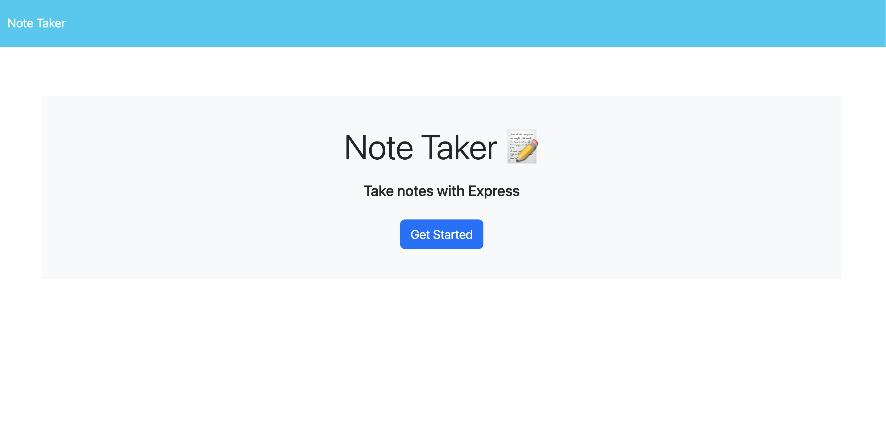
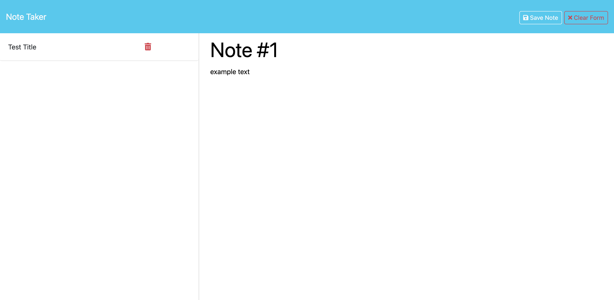
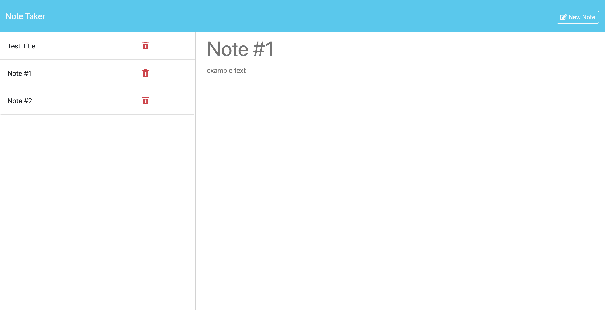

# Module 11: Express.js / Note Taker

## Description
This is the challenge for Module 11 of the coding bootcamp. This is a an application hosted on Render that can be used to write, save, and delete notes. This application uses an Express.js back end, and saves and retrieves note data from a JSON file.

### User Story
```
AS A small business owner
I WANT to be able to write and save notes
SO THAT I can organize my thoughts and keep track of tasks I need to complete
```

### Acceptance Criteria
```
GIVEN a note-taking application
WHEN I open the Note Taker
THEN I am presented with a landing page with a link to a notes page
WHEN I click on the link to the notes page
THEN I am presented with a page with existing notes listed in the left-hand column, plus empty fields to enter a new note title and the note’s text in the right-hand column
WHEN I enter a new note title and the note’s text
THEN a "Save Note" button and a "Clear Form" button appear in the navigation at the top of the page
WHEN I click on the Save button
THEN the new note I have entered is saved and appears in the left-hand column with the other existing notes and the buttons in the navigation disappear
WHEN I click on an existing note in the list in the left-hand column
THEN that note appears in the right-hand column and a "New Note" button appears in the navigation
WHEN I click on the "New Note" button in the navigation at the top of the page
THEN I am presented with empty fields to enter a new note title and the note’s text in the right-hand column and the button disappears
```

## Application
This application has been deployed on Render [here](https://module-11-note-taker.onrender.com).

The user will be presented with a landing page.


Once the user clicks on the button, they will be redirected to the notes page. They can create and save a new note if they click on the textarea on the right side.


The user can also view and delete previous notes by clicking on it/the trash bin within the list on the left side.
